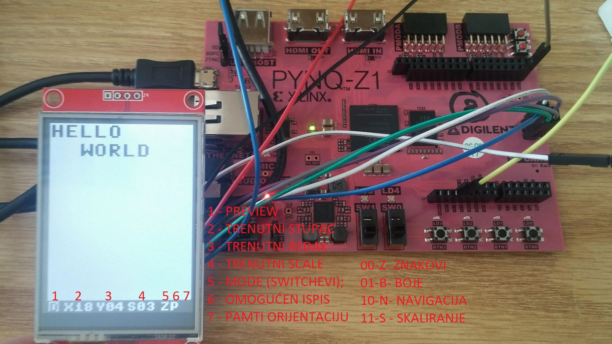
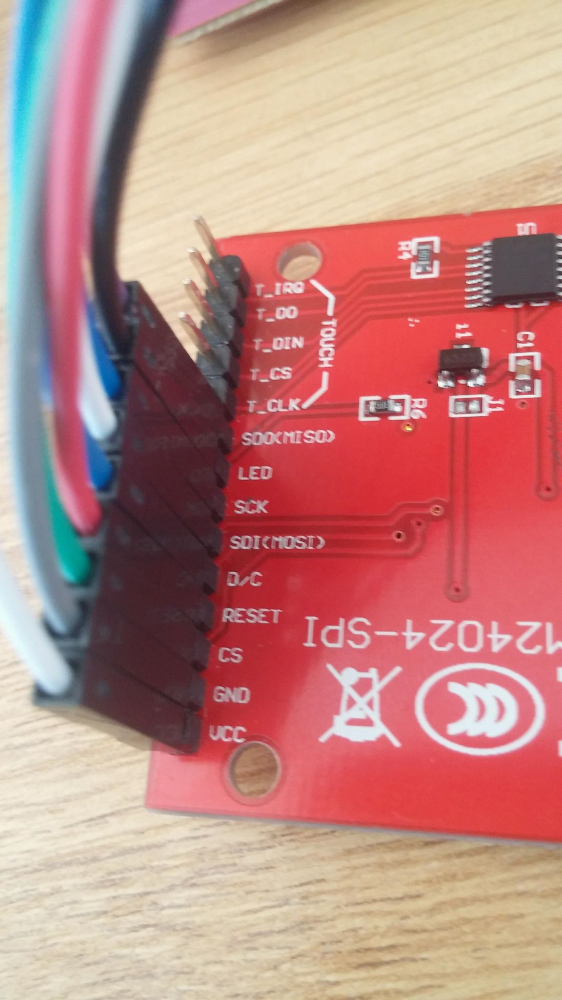
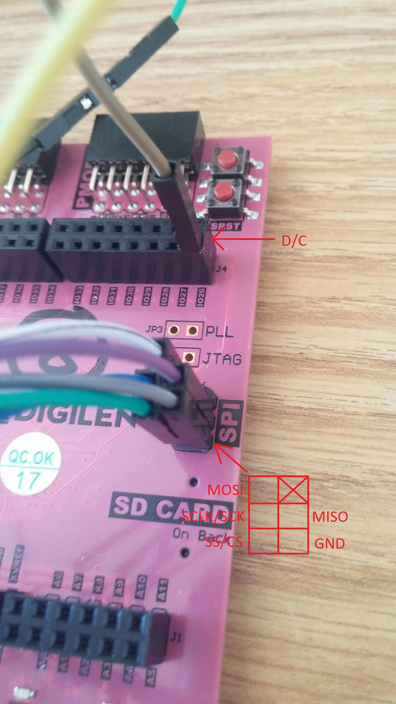
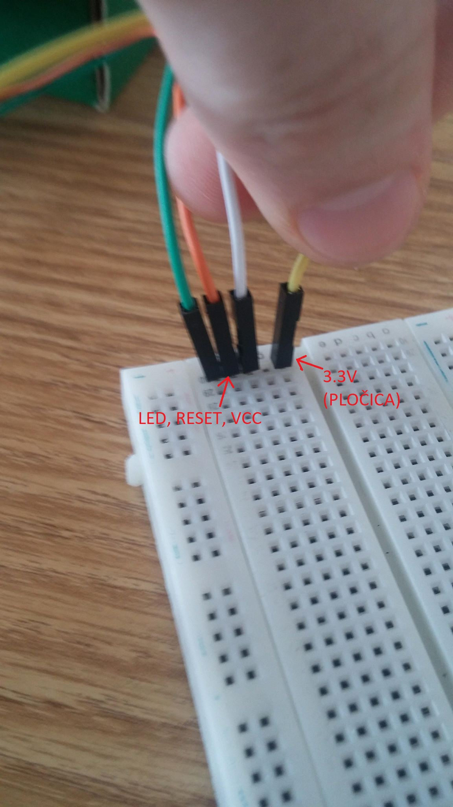
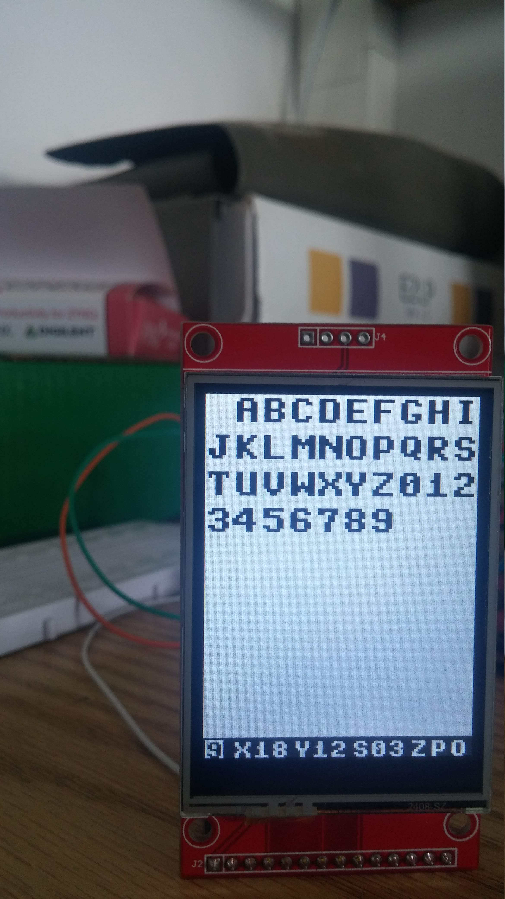
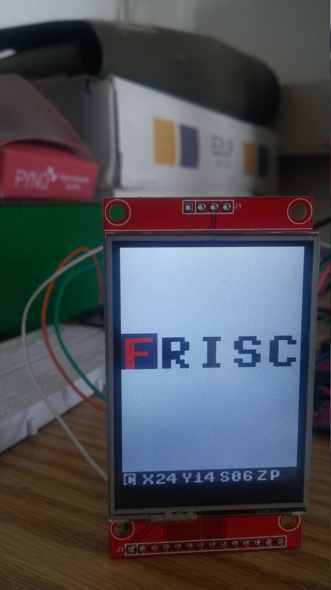
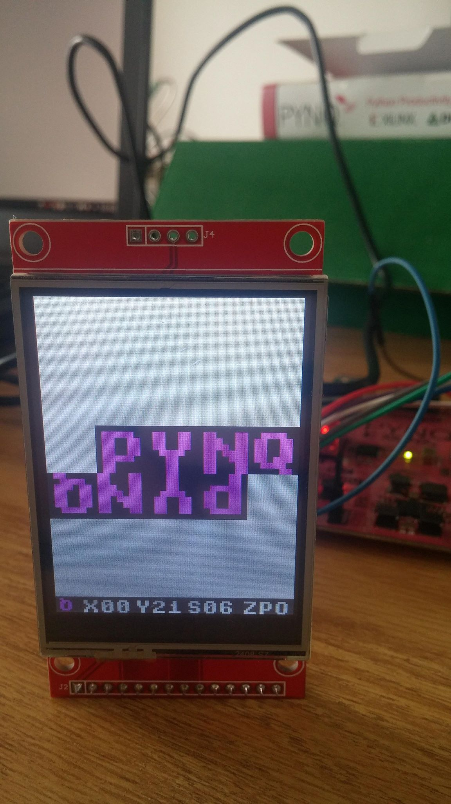
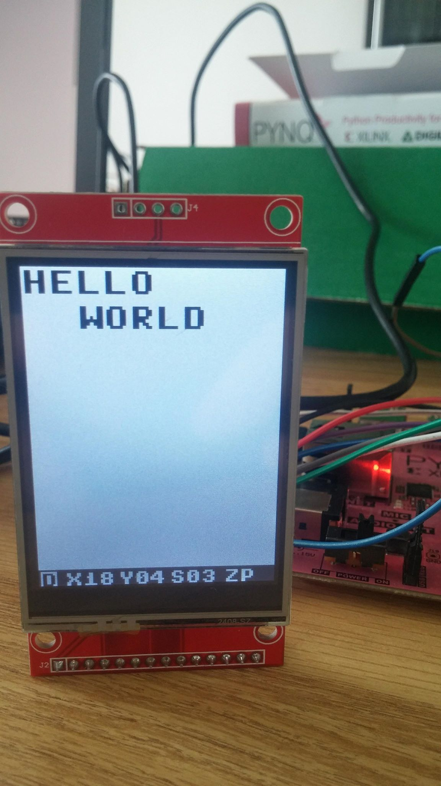

# FRISC-PYNQ-lab2

[@Marko Lazarić](https://github.com/mlazaric), [@Tin Blažević](https://github.com/TinBlazevic)

## Sadržaj
- [Zadatak](#zadatak)
- [Rješenje](#rješenje)
- [Korisničko sučelje](#korisničko-sučelje)
- [Upute za korištenje](#upute-za-korištenje)
  - [00 - UI zastavica Z (znakovi)](#00---ui-zastavica-z-znakovi)
  - [01 - UI zastavica B (boje)](#01---ui-zastavica-b-boje)
  - [10 - UI zastavica N (navigacija)](#10---ui-zastavica-n-navigacija)
  - [11 - UI zastavica S (skaliranje)](#11---ui-zastavica-s-skaliranje)
- [Upute za spajanje](#upute-za-spajanje)
- [Primjeri](#primjeri)

## Zadatak: 
Zadatak 8 - Ispisivanje slova i znamenki

Oprema:
- LCD display
- žice
- protoboard

Zadatak je napraviti potprogram za ispisivanje slova i znamenki na LCD zaslon. Potprogram
preko stoga prima više parametara:
1. Pozicija X
2. Pozicija Y
3. Orijentacija (0 ili 1)
4. Boja znaka
5. Boja pozadine znaka
6. Kod znaka (može biti ASCII ili po izboru)

Napomene:
1. Svaki znak je potrebno definirati u memoriji
2. Svi znakovi su osnovne veličine od 8x8 piksela
3. Za opis jednog znaka potrebno je 8 bajtova (8x8 bitova - piksela) od kojih svaki bit
određuje ispunjava li se određeni piksel bojom znaka ili pozadine
4. U datoteci s primjerima postoji program koji koristi LCD, rutinu koja inicijalizira LCD se
može preuzeti kompletno od tog rješenja

## Rješenje:
U memoriji se nalaze praznina, znakovi engleske abecede, znamenke i boje.  
Osnovna veličina je 8x8 piksela.  
Iz primjera je preuzeta rutina za inicijalizaciju lcd-a i potprogram za crtanje pravokutnika.  

## Korisničko sučelje: 
| # | Objašnjenje                          |
|---|--------------------------------------|
| 1 | Pretpregled znaka za ispis           |
| 2 | Trenutni redak                       |
| 3 | Trenutni stupac                      |
| 4 | Trenutni faktor skaliranja           |
| 5 | Zastavica za način rada              |
| 6 | Zastavica za omogućen ispis          |
| 7 | Zastavica za spremanje orijentacije  |

## Upute za korištenje:
Pritisnuti sva 4 gumba odjednom u bilo kojem načinu rada za reset.

Položaj switcheva definira načine rada (SW1 - lijevi bit, SW0 - desni bit)

### 00 - UI zastavica Z (znakovi)  
| Gumb | Funkcija                                           |
|------|----------------------------------------------------|
| btn3 | Odaberi prethodni znak u memoriji                  |
| btn2 | Odaberi sljedeći znak u memoriji                   |
| btn1 | Komplementira omogućavanje upisa (UI zastavica P)  |
| btn0 | Omogući upis i upiši znak                          |
    
### 01 - UI zastavica B (boje) 
| Gumb | Funkcija                                           |
|------|----------------------------------------------------|
| btn3 | Odaberi prethodnu boju pozadine (background)       |
| btn2 | Odaberi sljedeću boju pozadine (background)        |
| btn1 | Odaberi prethodnu boju znaka (foreground)          |
| btn0 | Odaberi sljedeću boju znaka (foreground)           | 
    
### 10 - UI zastavica N (navigacija)  
| Gumb | Funkcija                                                      |
|------|---------------------------------------------------------------|
| btn3 | Smanji redak za 1, odnosno pomakni se gore za 8 piksela       |
| btn2 | Povećaj redak za 1, odnosno pomakni se dolje za 8 piksela     |
| btn1 | Smanji stupac za 1, odnosno pomakni se lijevo za 8 piksela    |
| btn0 | Povećaj stupac za 1, odnosno pomakni se desno za 8 piksela    | 
    
### 11 - UI zastavica S (skaliranje)
| Gumb | Funkcija                         |
|------|----------------------------------|
| btn3 | Povećaj faktor skaliranja za 1   |
| btn2 | Smanji faktor skaliranja za 1    |
| btn1 | Zrcali s obzirom na x-os         |
| btn0 | Zrcali s obzirom na y-os         | 
	
 * **btn1 i btn2** ili **btn3 i btn4** - spremanje orijentacije on/off (UI zastavica O)
    

## Upute za spajanje:

## Primjeri:

